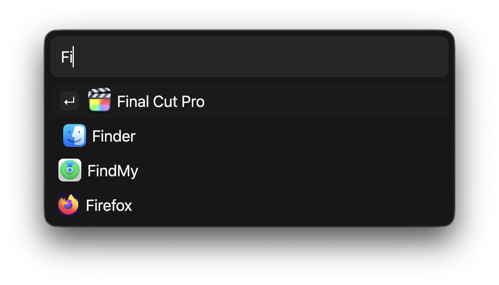

# Fetch 

No-bullshit app launcher, that doesn't slow you down like Spotlight does. 

Currently only supports macOS. It is still a WIP but basic functionality is implemented.



## How to use

- Ensure app is launched
- Option+Space (⌥+Space) to start a search
- Search for the app you want
- Press enter to launch the first result
- Otherwise click the entry with your cursor

### Configuring the app

While the search bar is active, press Cmd+T to open the configuration file. The app requires a restart to update its configuration.

## Features

- It's really fast. App launches instantly. Searches happen instantly.
- Uses a native renderer.
- Lightweight app.
- Dead simple.
- Predictive search that learns as you go.

## Build It Yourself

At this time there are no pre-packaged releases, so you will need to build the app yourself. Feel free to edit basic configuration (such as Hotkey) in `src/fs/config.rs` before compiling.

You'll need `cargo bundle`:
- `cargo install cargo-bundle`

Then run `bundle.sh`:

```bash
chmod +x bundle.sh
./bundle.sh
```

Alternatively, run: `RUSTFLAGS='-C target-cpu=native' cargo bundle --release`

## Roadmap

The roadmap is available at https://github.com/users/hackerbirds/projects/3. The current plan is to reach a 1.0 release, after which the app will be considered complete.